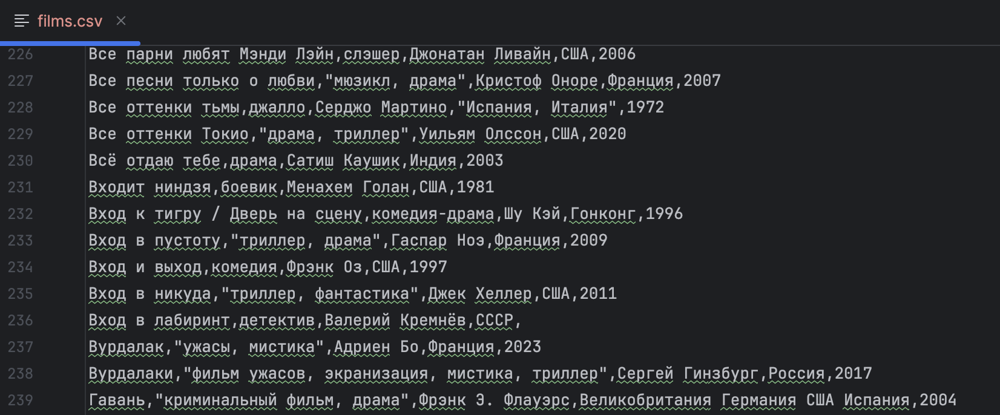

# WikiFilmHarvester

Парсер фильмов из категории Википедии **«Фильмы по алфавиту»**.
Собирает: **Название, Жанр, Режиссер, Страна, Год** и сохраняет в CSV.

## Стек

* Python
* Scrapy
* uv (для запуска окружения)

## Установка

```bash
uv sync
```

## Запуск (одной командой)

1. Получи ключ OMDb: [https://www.omdbapi.com/apikey.aspx](https://www.omdbapi.com/apikey.aspx)
2. Задай ключ и запусти:

```bash
export OMDB_API_KEY="your_api_key"
make run
```

> Если нужно изменить количество фильмов для теста — открой `Makefile` и поменяй значение `CLOSESPIDER_ITEMCOUNT`.

## Пример работы


